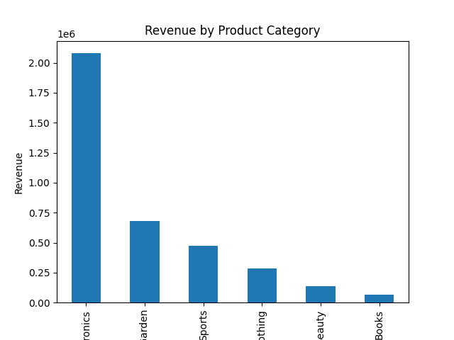

# 📊 Globex Retail

## 📌 Overview
This project explores how **Globex Retail**, a hybrid **e-commerce + brick-and-mortar retailer**, leverages **data engineering and analytics** to transform raw customer purchase data into actionable insights.  

The goal is to:  
- Enhance **customer retention**  
- Optimize **inventory levels**  
- Drive revenue through **targeted marketing**  
- Enable **data-driven decision making**  

## 📊 Visualizations

### Revenue by Product Category


---

## ✨ Features
- 📑 **Data Extraction** — Extract sales transaction data from PDF reports using **Tabula**.  
- 🧹 **Data Cleaning** — Standardize columns (dates, quantities, prices, discounts).  
- ⚙️ **Feature Engineering** — Create new fields like **Revenue**, **AOV**, and **Monthly Trends**.  
- 📊 **Exploratory Data Analysis (EDA)** — Identify high-value customers, top-selling categories, and geographic insights.  
- 📈 **Business Insights**:  
  - Revenue by **Product Category & Sub-Category**  
  - Customer **Average Order Value (AOV)**  
  - Impact of **Discounts** on Revenue  
  - Top **Customer Locations**  
  - **Monthly Revenue Trends**  

---

## 🗂 Dataset Description
The dataset includes:  

1. **Customer_ID** — Unique identifier for each customer  
2. **Order_ID** — Unique identifier for each order  
3. **Order_Date** — Date the order was placed  
4. **Product_Category** — Main category of the purchased product  
5. **Product_Sub_Category** — More specific category of the product  
6. **Quantity** — Number of units purchased  
7. **Price** — Price per unit  
8. **Discount** — Discount applied (fractional)  
9. **Customer_Location** — Customer’s state location  
10. **Revenue** — Calculated metric = `Quantity × Price × (1 - Discount)`  

---

## 🛠️ Tech Stack
- **Python 3.11+**
- **Pandas** — Data manipulation & feature engineering  
- **Matplotlib** — Visualization  
- **Tabula-py** — PDF table extraction  
- **Jupyter Notebook** — Interactive analysis  

---

## 📂 Project Structure

---

## ⚙️ Setup Instructions

### 1. Clone the repository
```bash
git clone https://github.com/yourusername/globex-retail-analysis
cd globex-retail-analysis

2. Create a virtual environment
python -m venv venv
source venv/bin/activate
venv\Scripts\activate      


3. Install dependencies
pip install -r requirements.txt

pandas
matplotlib
tabula-py

▶️ Usage
1. Place globex_data.pdf in the project folder.
2. Run the analysis script:
- python analysis.py

3. The script will:
- Extract PDF tables → CSV
- Clean and process the dataset
- Generate KPIs & business insights
- Produce a bar chart of Revenue by Product Category

📊 Key Business Questions Answered
- Which product categories and sub-categories generate the most revenue?
- Which customers have the highest Average Order Value (AOV)?
- What is the average discount given to high-value customers?
- Which locations have the highest concentration of top customers?

How do discounts impact revenue by category?

What are the monthly revenue trends?

📈 Example Insights (from Globex Data)
- Electronics is the top revenue generator, followed by Home & Garden and Clothing.
- The top 10% of customers contribute disproportionately to revenue.
- Discounts are most common in Clothing & Beauty, while Electronics revenue is less discount-dependent.
- Texas, New Jersey, and Colorado emerge as key high-value customer locations.
- Monthly sales show strong growth in Q1, with Electronics driving much of the revenue.

⚠️ Disclaimer

This project is part of a capstone case study. It is provided for educational purposes only and not intended for commercial use. 
